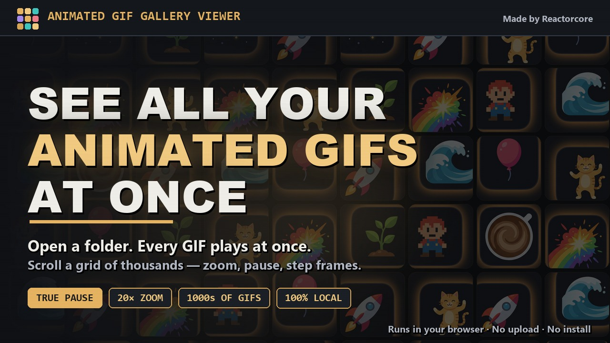

# Animated GIF Gallery Viewer

**AVAILABLE HERE:** https://reactorcore.itch.io/animated-gif-gallery-viewer

**Open a folder. Every animated GIF inside it plays at once, in a grid you can
scroll, zoom, and pause.**

Viewing a folder full of animated GIFs on Windows or macOS is genuinely
miserable. The built-in viewers show you one file at a time, thumbnails don't
animate, and clicking through a few hundred GIFs to find the one you want is a
waste of an afternoon.

This is a small web app that fixes that. Point it at a folder and the whole
collection animates together on one page.

---

## What it does

- **Everything animates at once.** The whole folder plays together — no
  clicking through files one at a time.
- **Built for big folders.** Thousands of GIFs stay smooth, because only what's
  actually on screen is decoded and animated.
- **True pause.** Freeze any GIF exactly where it is, then step through it one
  frame at a time, forwards or backwards.
- **Zoom and fullscreen.** Click any GIF to zoom, scroll to scale it from 1× to
  20×, or let a single GIF fill your entire display.
- **Transparency backdrops.** Swap the colour behind your GIFs — checkerboard,
  black, white, or a keying colour — to check transparent edges.
- **Find things fast.** Filter by filename, sort by name, size, or date,
  shuffle the order, and star favorites.
- **Completely private.** Files never leave your machine. No server, no upload,
  no account, no telemetry.
- **Runs anywhere.** It's a folder of static files. Works online, or straight
  off your disk with no install.

## Getting started

**Online:** just open the page and click *Open Folder*.

**Offline:** unzip the download and double-click `index.html`. That's the whole
installation process — there's nothing to install, no runtime, no dependencies.

Then click **Open Folder**, pick a folder of GIFs, and everything plays.

Tick **Subfolders** before opening if you want nested folders included too.

See [guide.md](guide.md) for the full walkthrough and every keyboard shortcut.

## Controls at a glance

| Key | Does |
| --- | --- |
| `Scroll` | Browse the grid |
| `Click` | Zoom a GIF |
| `Space` | Pause the GIF under the cursor |
| `←` `→` | Next / previous GIF — or step frames while paused |
| `F` | Fullscreen the zoomed GIF |
| `F11` | Browser fullscreen (hides all browser chrome) |
| `/` | Jump to the filename filter |
| `Esc` | Close the zoom view |
| `F5` | Reload to pick a different folder |

## Requirements

A current version of **Chrome, Edge, or Firefox**. Safari is not supported —
it doesn't implement the directory-picking API this relies on.

Only `.gif` files are loaded; everything else in the folder is ignored.

## Privacy

Nothing is uploaded, ever. Your GIFs are read directly by the browser from your
own disk and never touch a network. There is no server component, no analytics,
and no account system.

Your settings and favorites are stored in your browser's local storage on your
own machine. Paused GIFs are deliberately *not* remembered between sessions.

## A note on folder paths

Browsers deliberately withhold the absolute path of a folder you pick, so the
app can only show the folder's name, not its full location on disk. That's a
security boundary in the browser, not an oversight here.

## License

Released under the **MIT License** — free to use, modify, and redistribute,
including commercially. Provided as-is, without warranty.

If you build something with it, a credit is appreciated but not required.

---

## Contact

mailto:reactorcoregames@gmail.com

---

Check out everything else I do: ✨🚀

https://linktr.ee/reactorcore

https://reactorcore.itch.io/

-Reactorcore

---

My other links:
Home/Links: https://linktr.ee/reactorcore
Releases: https://reactorcore.itch.io
Blog: https://www.patreon.com/ReactorcoreGames
Discord: https://discord.gg/UdRavGhj47
Catalog: https://reactorcoregames.github.io/

---

Made by Reactorcore — https://linktr.ee/reactorcore
